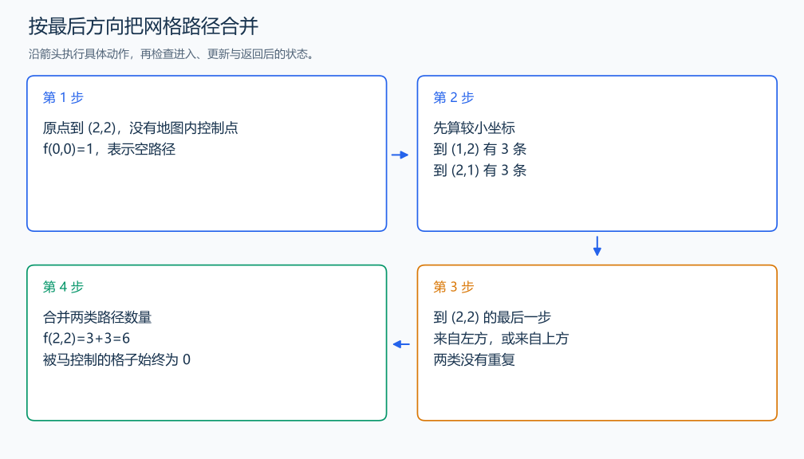

# P1002 过河卒

[原题入口](https://www.luogu.com.cn/problem/P1002)

对应章节：五、数据结构与算法 → （十二） 搜索：递归、回溯、DFS、BFS 与记忆化；五、数据结构与算法 → （十三） 动态规划（DP）基础。

## （一） 任务与输出目标

卒只向右或向下走，避开马及马控制点，统计到终点的路径数。

## （二） 建模与推导

先标记马所在点与八个马步落点。定义 f(x,y) 为从原点到当前点的合法路径数。未被控制的点，其最后一步来自左边或上边；去掉最后一步得到相应前驱，接回唯一，两类最后移动方向不同，故相加。被控制点没有合法方案，状态为 0。

原点放置一条空路径，按横纵坐标递增填表。每次只读更小坐标，答案在终点。棋盘共有 (n+1)×(m+1) 个坐标点，0 坐标也参与计算。

## （三） 手算与过程

终点 (2,2)，马在 (20,20)：没有地图内控制点，状态最后为 6，等于两次右移与两次下移的排列数。



## （四） 带注释实现

[完整源文件](../../code/P1002.cpp)

```cpp
#include <bits/stdc++.h> // 竞赛模板中的常用标准库工具。
#define int long long   // 统一使用较大的整数类型。
#define endl '\n'       // 普通输出换行，避免逐行刷新。
using namespace std;

void solve() {
    int n,m,hx,hy; cin >> n >> m >> hx >> hy;
    vector<vector<bool>> blocked(n+1,vector<bool>(m+1,false));
    int dx[9]={0,1,1,-1,-1,2,2,-2,-2}, dy[9]={0,2,-2,2,-2,1,-1,1,-1};
    for (int d=0;d<9;++d) {
        int x=hx+dx[d],y=hy+dy[d];
        if(x>=0&&x<=n&&y>=0&&y<=m) blocked[x][y]=true; // 只标地图中的控制点。
    }
    vector<vector<long long>> f(n+1,vector<long long>(m+1,0));
    for(int x=0;x<=n;++x) for(int y=0;y<=m;++y) {
        if(blocked[x][y]) continue;
        if(x==0&&y==0) { f[x][y]=1; continue; }
        if(x>0) f[x][y]+=f[x-1][y];
        if(y>0) f[x][y]+=f[x][y-1]; // 两类最后一步的路径相加。
    }
    cout << f[n][m] << '\n';
}

signed main() {
    ios::sync_with_stdio(false); // 关闭同步，使用 cin 与 cout 完成输入输出。
    cin.tie(0), cout.tie(0);

    int T = 1; // 本题读入一组数据。
    // cin >> T; // 题目给出测试组数时开启，并在 solve 中处理一组。
    while (T--)
        solve();
}
```

头文件 `<bits/stdc++.h>` 汇总 GNU C++ 的常用标准库，包含本程序使用的流、容器与算法；这是序言竞赛模板中的包含方式。

## （五） 复杂度

时间与空间均为 $O(nm)$。

[返回本章题解索引](README.md) · [返回全部题号索引](../../README.md)
