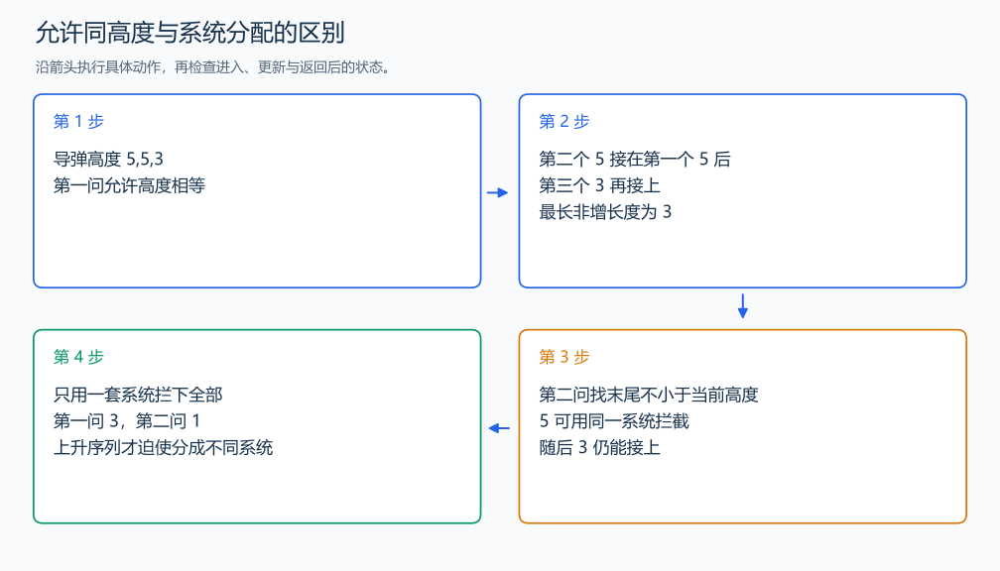

# P1020 导弹拦截

[原题入口](https://www.luogu.com.cn/problem/P1020)

对应章节：五、数据结构与算法 → （十三） 动态规划（DP）基础。

## （一） 任务与输出目标

求最长非增子序列长度，以及覆盖所有导弹的最少非增序列条数。

## （二） 建模与推导

第一问按结尾推导：导弹 x 可以接在此前高度不小于 x 的导弹之后。把同一长度的候选压缩为“尽可能高的末尾”，因为较高末尾能接的后续高度更多。维护降序 tail，找到第一个严格小于 x 的位置并替换；相等可以接在末尾，所以使用 upper_bound 配合 greater。

第二问先得到下限：一条严格递增子序列中的导弹不能由同一系统拦截，因此系统数至少为 LIS 长度。再构造分配：对新高度 x，使用末尾高度不小于 x 且尽可能小的系统，替换它的末尾；找不到时才新建。末尾更高的系统留下处理其他高度，不会减少可选分配。这个过程的数组更新恰好也是 LIS 的 lower_bound 更新，因此系统数等于 LIS 长度，达到下限。输入没有个数，用 EOF 读完。

## （三） 手算与过程

5,5,3 可由一套系统全部拦截，第一问为 3、第二问为 1；1,2,3 必须分三套，第一问为 1、第二问为 3。



## （四） 带注释实现

[完整源文件](../../code/P1020.cpp)

```cpp
#include <bits/stdc++.h>
#define int long long
#define endl '\n'
using namespace std;

void solve() {
    vector<int> tail, systems;
    int x;
    while (cin >> x) {
        auto it =
            upper_bound(tail.begin(), tail.end(), x, greater<int>()); // 非增允许相等继续延长。
        if (it == tail.end())
            tail.push_back(x);
        else
            *it = x;
        auto use = lower_bound(systems.begin(), systems.end(), x); // 最小的、仍能拦截 x 的末尾。
        if (use == systems.end())
            systems.push_back(x);
        else
            *use = x;
    }
    cout << tail.size() << '\n' << systems.size() << '\n';
}

signed main() {
    ios::sync_with_stdio(false); // 关闭同步，使用 cin 与 cout 完成输入输出。
    cin.tie(0), cout.tie(0);

    int T = 1; // 本题读入一组数据。
    // cin >> T; // 题目给出测试组数时开启，并在 solve 中处理一组。
    while (T--)
        solve();
}
```

## （五） 复杂度

时间 $O(n\log n)$，空间 $O(n)$。

[返回本章题解索引](README.md) · [返回全部题号索引](../../README.md)
