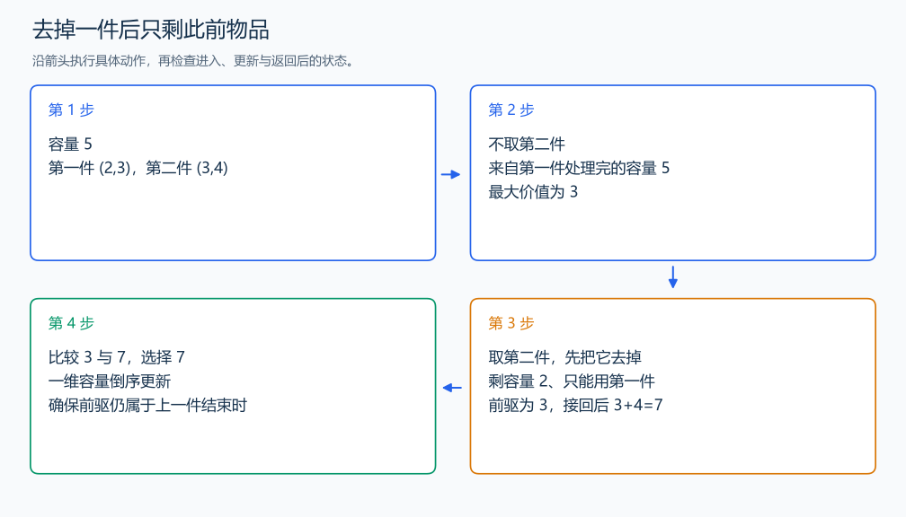

# P1048 采药

[原题入口](https://www.luogu.com.cn/problem/P1048)

对应章节：序言 → 建议的自学顺序与练习；五、数据结构与算法 → （十三） 动态规划（DP）基础。

## （一） 任务与输出目标

每株至多采一次，在给定总时间中最大化总价值。

## （二） 建模与推导

定义 f(i,j) 为只使用前 i 种（件）物品、总消耗不超过 j 的最大价值。按是否使用第 i 种分类：不用时来自 f(i-1,j)；使用时删去一份，剩余容量是 j-cost，接回得到前驱价值加 value。

每件只用一次，删掉当前件后剩余物品范围必须是前 i-1 件，所以前驱为 f(i-1,j-cost)。由此 $f(i,j)=\max(f(i-1,j),f(i-1,j-cost)+value)$。压成一维后容量倒序，j-cost 还没有在本轮更新，读到的是上一件处理结束的状态。

初始全为 0，表示不取物品；较优前驱替换较差前驱后，物品范围与总消耗仍成立，所以只保存最大价值。所有物品处理后读总容量位置。

## （三） 手算与过程

容量 5，两件 (2,3)、(3,4)：第二件的候选从第一件、容量 2 的值 3 接回得到 7。



## （四） 带注释实现

[完整源文件](../../code/P1048.cpp)

```cpp
#include <bits/stdc++.h>
using namespace std;


int main() {
    int capacity,n; cin >> capacity >> n;
    vector<long long> dp(capacity+1,0);
    for (int i=0;i<n;++i) {
        int cost,value;
        cin >> cost >> value;
        for (int j=capacity;j>=cost;--j)
            dp[j]=max(dp[j],dp[j-cost]+value); // 倒序读取上一轮状态，每件只用一次。
    }
    cout << dp[capacity] << '\n';
}
```

头文件 `<bits/stdc++.h>` 汇总 GNU C++ 的常用标准库，包含本程序使用的流、容器与算法；这是序言竞赛模板中的包含方式。

## （五） 复杂度

时间 $O(nC)$，一维空间 $O(C)$。

[返回本章题解索引](README.md) · [返回全部题号索引](../../README.md)
