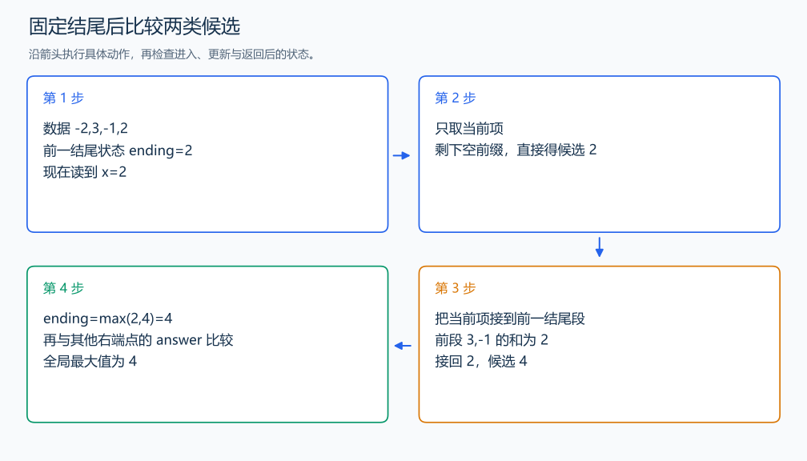

# P1115 最大子段和

[原题入口](https://www.luogu.com.cn/problem/P1115)

对应章节：三、解题方法论：从题意到代码 → （九） 建模与推导中的典型反例；五、数据结构与算法 → （十三） 动态规划（DP）基础。

## （一） 任务与输出目标

选一段连续且非空的序列，使和最大。

## （二） 建模与推导

先固定右端点 i，定义 `ending[i]` 为以 i 结尾的非空连续段最大和。这样的段只有两类：只有当前一项 `a[i]`；或从前一位置结尾的段接上 `a[i]`。删去最后一项，后一类的剩余段必须以 i-1 结尾，替换成 `ending[i-1]` 对应的最好段只会增大总和，所以 $`ending[i]`=\max(`a[i]`,`ending[i-1]`+`a[i]`)$。

各右端点的方案合起来才包含全部连续段，答案另外取所有 ending 的最大值。用第一项初始化 ending 和 answer，保留非空含义；全为负数时仍会选其中最大的一项。

## （三） 手算与过程

-2,3,-1,2 的 ending 为 -2,3,2,4；答案为 4，来自 3,-1,2。全负数 -5,-2 的答案是 -2。



## （四） 带注释实现

[完整源文件](../../code/P1115.cpp)

```cpp
#include <bits/stdc++.h>
using namespace std;


int main() {
    int n; cin >> n;
    long long x; cin >> x;
    long long ending=x,answer=x; // 以第一项结尾的唯一非空段。
    for (int i=1;i<n;++i) {
        cin >> x;
        ending=max(x,ending+x); // 新开一段，或接到前一结尾状态。
        answer=max(answer,ending); // 全局答案还要比较不同右端点。
    }
    cout << answer << '\n';
}
```

头文件 `<bits/stdc++.h>` 汇总 GNU C++ 的常用标准库，包含本程序使用的流、容器与算法；这是序言竞赛模板中的包含方式。

## （五） 复杂度

时间 $O(n)$，额外空间 $O(1)$。

[返回本章题解索引](README.md) · [返回全部题号索引](../../README.md)
