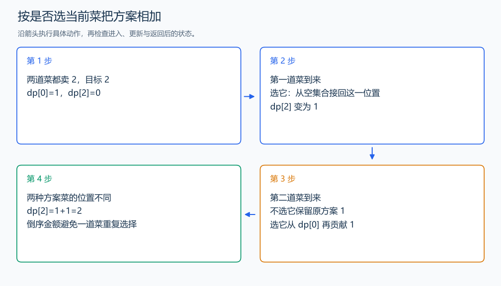

# P1164 小 A 点菜

[原题入口](https://www.luogu.com.cn/problem/P1164)

对应章节：五、数据结构与算法 → （十三） 动态规划（DP）基础。

## （一） 任务与输出目标

每道菜只有一份，统计价格之和恰好为 M 的位置集合数。

## （二） 建模与推导

f(i,j) 表示前 i 道菜恰好花 j 元的方案数。不选第 i 道来自 f(i-1,j)；选它的方案删去这道菜后，来自前 i-1 道、金额 j-price 的方案。接回菜的位置唯一，两类也由是否选该位置区分，没有重复，所以 $f(i,j)=f(i-1,j)+f(i-1,j-price)$。同价菜依旧是不同位置。

f(0,0)=1 是空集合，其他金额为 0。压成一维后金额倒序，仍读上一轮状态，避免同一道菜重复选择。计数最多有 2^100 个子集，代码用 GNU 的 __int128 保存中间计数；它是 128 位整数，使用方法和普通整数相同。题目输出量能用普通整数表示，最终转换为 long long 输出。

## （三） 手算与过程

两道菜都卖 2 元，目标 2：两道菜各自成为一种选择，答案 2；目标 4 时只能两道一起选，答案 1。



## （四） 带注释实现

[完整源文件](../../code/P1164.cpp)

```cpp
#include <bits/stdc++.h>
using namespace std;


int main() {
    int n,m; cin >> n >> m;
    vector<__int128> dp(m+1,0); dp[0]=1; // 空集合是恰好花 0 元的一种方案。
    for (int i=0;i<n;++i) {
        int price; cin >> price;
        for (int j=m;j>=price;--j) dp[j]+=dp[j-price]; // 加上选当前菜的位置集合。
    }
    cout << (long long)dp[m] << '\n';
}
```

头文件 `<bits/stdc++.h>` 汇总 GNU C++ 的常用标准库，包含本程序使用的流、容器与算法；这是序言竞赛模板中的包含方式。

## （五） 复杂度

时间 $O(nM)$，空间 $O(M)$，每项 16 字节。

[返回本章题解索引](README.md) · [返回全部题号索引](../../README.md)
