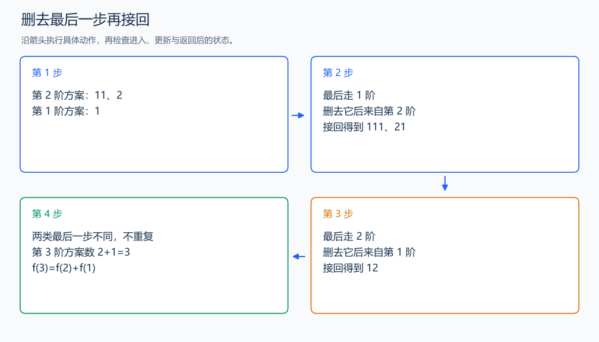

# P1255 数楼梯

[原题入口](https://www.luogu.com.cn/problem/P1255)

对应章节：五、数据结构与算法 → （十三） 动态规划（DP）基础。

## （一） 任务与输出目标

每步走一阶或两阶，求走到第 N 阶的精确方案数。

## （二） 建模与推导

把方案按最后一步分类：走一阶的方案去掉最后一步，剩下恰好是到 N-1 阶的走法；走两阶同理来自 N-2 阶。接回最后一步能唯一恢复原方案，两类的最后一步不同，没有重复，因此相加：$f(N)=f(N-1)+f(N-2)$。

f(0)=1 表示还没走的空方案，f(1)=1。按阶数从小到大计算，读到的两个前驱都已经完成；最终答案为 f(N)。只依赖前两项，可用 a、b 滚动保存。方案数随 N 增长，代码用十进制字符串逐位进位，输出完整整数。

## （三） 手算与过程

第 3 阶：来自第 2 阶的 11、2 各接 1，得到 111、21；来自第 1 阶的 1 接 2，得到 12，共 3 种。



## （四） 带注释实现

[完整源文件](../../code/P1255.cpp)

```cpp
#include <bits/stdc++.h>
using namespace std;

string add(string a,string b) {
    string result; int i=a.size()-1,j=b.size()-1,carry=0;
    while (i>=0 || j>=0 || carry) {
        int value=carry;
        if (i>=0) value+=a[i--]-'0';
        if (j>=0) value+=b[j--]-'0';
        result.push_back('0'+value%10); carry=value/10; // 保存当前位并传递进位。
    }
    reverse(result.begin(),result.end()); return result;
}

int main() {
    int n; cin >> n;
    string a="1",b="1"; // f(0)、f(1)。
    for (int i=2;i<=n;++i) {
        string c=add(a,b); // 两种最后一步的方案数量相加。
        a=b; b=c;
    }
    cout << b << '\n';
}
```

头文件 `<bits/stdc++.h>` 汇总 GNU C++ 的常用标准库，包含本程序使用的流、容器与算法；这是序言竞赛模板中的包含方式。

## （五） 复杂度

N 次相加，答案位数 D=O(N)，时间 $O(ND)=O(N^2)$，滚动存储 $O(D)$。

[返回本章题解索引](README.md) · [返回全部题号索引](../../README.md)
