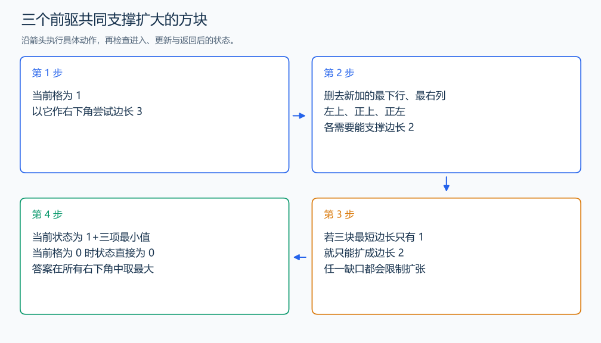

# P1387 最大正方形

[原题入口](https://www.luogu.com.cn/problem/P1387)

对应章节：五、数据结构与算法 → （三） 前缀和与差分。

## （一） 任务与输出目标

在 01 矩阵中求全为 1 的最大正方形边长。

## （二） 建模与推导

先用二维前缀和枚举候选：边长 k 的方块总和等于 k²，就说明全为 1。再看同一右下角的候选为何重复，改为只记录最大的。定义 f(i,j) 为以格子 (i,j) 作右下角的全 1 正方形最大边长。当前格是 0 时只能为 0。当前格是 1 时，边长 k 的候选删去最下行与最右列，要求左上、正上、正左三个位置至少都能支撑边长 k-1；反过来，三块的并集加上当前格正好填满边长 k 的区域。因此 $f(i,j)=1+\min(f(i-1,j-1),f(i-1,j),f(i,j-1))$。

外圈用零表示没有格子。按行从上往下、列从左往右填表，三个前驱都已算好，答案取全部右下角的最大值。

## （三） 手算与过程

矩阵 111/111/110：右下格为 0，最大方块是左上 2×2，答案 2；三个前驱中任一个不足都会限制扩张。



## （四） 带注释实现

[完整源文件](../../code/P1387.cpp)

```cpp
#include <bits/stdc++.h>
#define int long long
#define endl '\n'
using namespace std;

void solve() {
    int n, m;
    cin >> n >> m;
    vector<vector<int>> f(n + 1, vector<int>(m + 1, 0));
    int answer = 0;
    for (int i = 1; i <= n; ++i)
        for (int j = 1; j <= m; ++j) {
            int x;
            cin >> x;
            if (x == 1)
                f[i][j] =
                    1 + min({f[i - 1][j], f[i][j - 1], f[i - 1][j - 1]}); // 三块共同支撑扩张。
            answer = max(answer, f[i][j]);
        }
    cout << answer << '\n';
}

signed main() {
    ios::sync_with_stdio(false); // 关闭同步，使用 cin 与 cout 完成输入输出。
    cin.tie(0), cout.tie(0);

    int T = 1; // 本题读入一组数据。
    // cin >> T; // 题目给出测试组数时开启，并在 solve 中处理一组。
    while (T--)
        solve();
}
```

## （五） 复杂度

时间 $O(nm)$，表空间 $O(nm)$。

[返回本章题解索引](README.md) · [返回全部题号索引](../../README.md)
