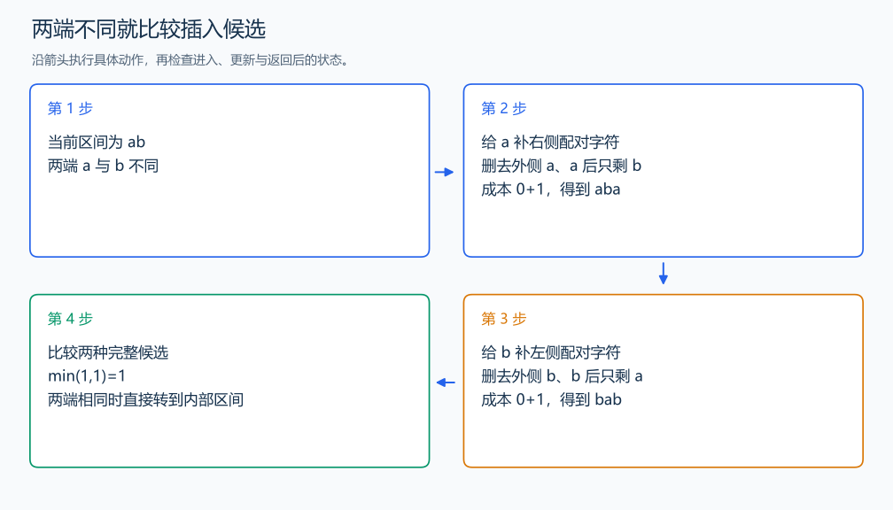

# P1435 回文字串

[原题入口](https://www.luogu.com.cn/problem/P1435)

对应章节：五、数据结构与算法 → （十三） 动态规划（DP）基础。

## （一） 任务与输出目标

插入最少字符，把给定字符串变成回文。

## （二） 建模与推导

定义 f(l,r) 为把原串下标 l 到 r 这段变成回文的最少插入数。只有一个字符时已经是回文，空段也无需插入。两端相同时，直接配对，删去这对后是 f(l+1,r-1)。两端不同时，它们无法互相配对：可以在右端补一个左端字符，留下 f(l+1,r)；或在左端补一个右端字符，留下 f(l,r-1)。接回一个新字符付出 1，取较小者：$f(l,r)=1+\min(f(l+1,r),f(l,r-1))$。

若两端都选择与新字符配对，可先完成其中一端，仍归入上面的候选，不会获得更低费用。按段长递增计算，所需的短段已经完成；答案为整段 f(0,n-1)。也可以由 n 减最长回文子序列长度得到相同结果。

## （三） 手算与过程

ab 的两种候选为 aba、bab，都插一次；aba 两端 a 配对后只剩 b，插入数为 0。



## （四） 带注释实现

[完整源文件](../../code/P1435.cpp)

```cpp
#include <bits/stdc++.h> // 竞赛模板中的常用标准库工具。
#define int long long   // 统一使用较大的整数类型。
#define endl '\n'       // 普通输出换行，避免逐行刷新。
using namespace std;

void solve() {
    string s; cin >> s; int n=s.size();
    vector<vector<int>> f(n,vector<int>(n,0));
    for (int length=2;length<=n;++length) for (int l=0;l+length<=n;++l) {
        int r=l+length-1;
        if (s[l]==s[r]) f[l][r]=(length==2?0:f[l+1][r-1]); // 两端直接配对。
        else f[l][r]=1+min(f[l+1][r],f[l][r-1]); // 补左端的配对字符，或补右端的配对字符。
    }
    cout << f[0][n-1] << '\n';
}

signed main() {
    ios::sync_with_stdio(false); // 关闭同步，使用 cin 与 cout 完成输入输出。
    cin.tie(0), cout.tie(0);

    int T = 1; // 本题读入一组数据。
    // cin >> T; // 题目给出测试组数时开启，并在 solve 中处理一组。
    while (T--)
        solve();
}
```

头文件 `<bits/stdc++.h>` 汇总 GNU C++ 的常用标准库，包含本程序使用的流、容器与算法；这是序言竞赛模板中的包含方式。

## （五） 复杂度

时间 $O(n^2)$，空间 $O(n^2)$。

[返回本章题解索引](README.md) · [返回全部题号索引](../../README.md)
