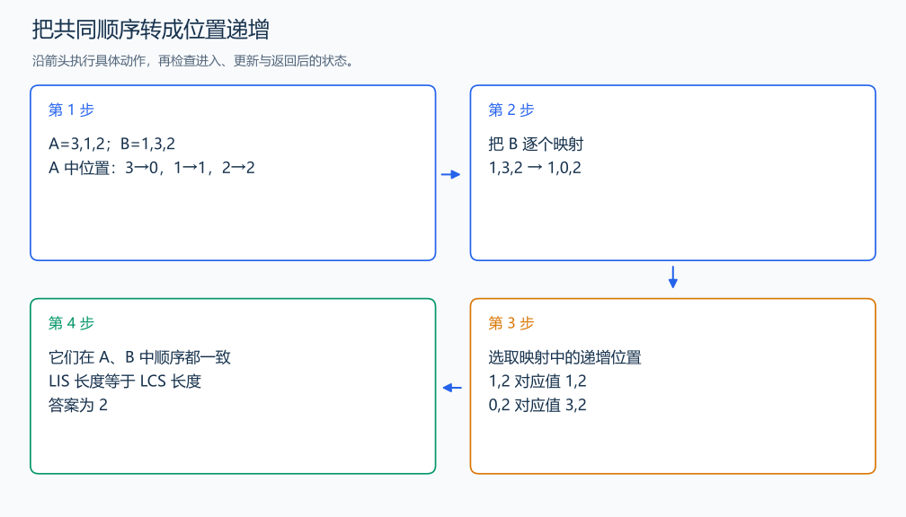

# P1439 两个排列的最长公共子序列

[原题入口](https://www.luogu.com.cn/problem/P1439)

对应章节：五、数据结构与算法 → （十三） 动态规划（DP）基础。

## （一） 任务与输出目标

求两个 1 到 n 的排列的 LCS 长度。

## （二） 建模与推导

记录每个值在 A 中的位置 pos，再把 B 的每个值替换成对应位置。B 中选择的顺序已满足 B 的子序列关系；要同时是 A 的子序列，所选位置必须严格递增。反过来，任何这样的递增位置序列都对应两个排列的公共子序列，且长度不变，所以目标等价于映射序列的 LIS。

用 `tail[len-1]` 保存长度 len 的递增子序列最小结尾。较小结尾能接上的后续值更多，同长度只保留它。读到 x 后，lower_bound 找第一个不小于 x 的末尾：前一个末尾小于 x，可接出这一长度；当前位置换成 x 不降低已经得到的长度。没有这样的位置时，新长度出现。

## （三） 手算与过程

A=3,1,2，B=1,3,2；位置映射为 1,0,2，LIS 长 2，对应公共子序列 1,2 或 3,2。



## （四） 带注释实现

[完整源文件](../../code/P1439.cpp)

```cpp
#include <bits/stdc++.h> // 竞赛模板中的常用标准库工具。
#define int long long   // 统一使用较大的整数类型。
#define endl '\n'       // 普通输出换行，避免逐行刷新。
using namespace std;

void solve() {
    int n; cin >> n;
    vector<int> pos(n+1),tail;
    for (int i=0;i<n;++i) { int x; cin >> x; pos[x]=i; }
    for (int i=0;i<n;++i) {
        int x; cin >> x; x=pos[x]; // 把数值换成它在第一个排列中的位置。
        auto it=lower_bound(tail.begin(),tail.end(),x);
        if (it==tail.end()) tail.push_back(x); else *it=x; // 同长度保留更小结尾。
    }
    cout << tail.size() << '\n';
}

signed main() {
    ios::sync_with_stdio(false); // 关闭同步，使用 cin 与 cout 完成输入输出。
    cin.tie(0), cout.tie(0);

    int T = 1; // 本题读入一组数据。
    // cin >> T; // 题目给出测试组数时开启，并在 solve 中处理一组。
    while (T--)
        solve();
}
```

头文件 `<bits/stdc++.h>` 汇总 GNU C++ 的常用标准库，包含本程序使用的流、容器与算法；这是序言竞赛模板中的包含方式。

## （五） 复杂度

时间 $O(n\log n)$，空间 $O(n)$。

[返回本章题解索引](README.md) · [返回全部题号索引](../../README.md)
