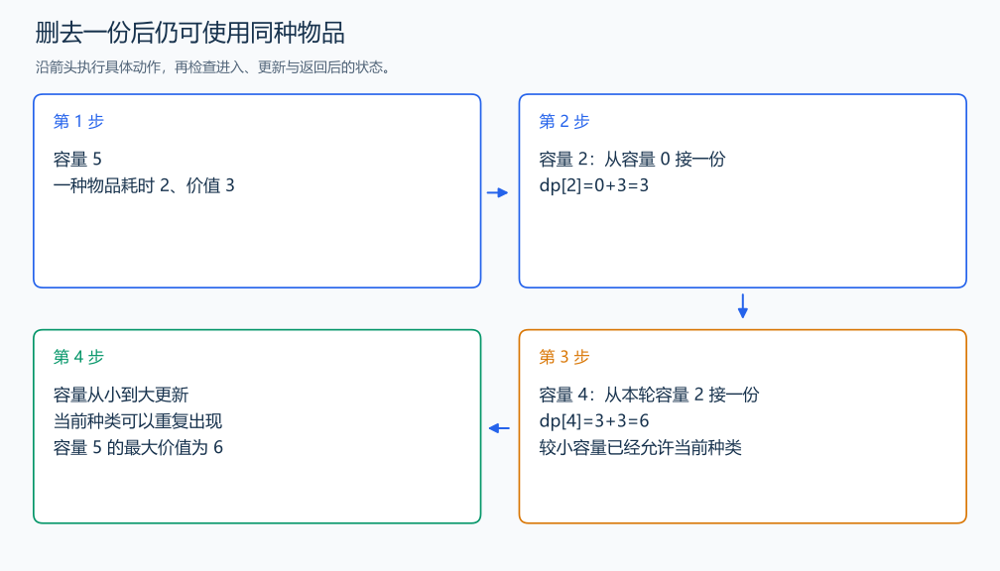

# P1616 疯狂的采药

[原题入口](https://www.luogu.com.cn/problem/P1616)

对应章节：五、数据结构与算法 → （十三） 动态规划（DP）基础。

## （一） 任务与输出目标

每种可以反复采摘，最大化总价值。

## （二） 建模与推导

定义 f(i,j) 为只使用前 i 种（件）物品、总消耗不超过 j 的最大价值。按是否使用第 i 种分类：不用时来自 f(i-1,j)；使用时删去一份，剩余容量是 j-cost，接回得到前驱价值加 value。

同一种可以重复使用，删去一份后剩余方案仍可以包含它，所以前驱是 f(i,j-cost)。由此 $f(i,j)=\max(f(i-1,j),f(i,j-cost)+value)$。容量从小到大处理，较小容量已经允许使用当前种类，所以能再接一份。

初始全为 0，表示不取物品；较优前驱替换较差前驱后，物品范围与总消耗仍成立，所以只保存最大价值。所有物品处理后读总容量位置。

## （三） 手算与过程

容量 5，一件 (耗时2,价值3)：完全背包可以采两份，得到 6。



## （四） 带注释实现

[完整源文件](../../code/P1616.cpp)

```cpp
#include <bits/stdc++.h> // 竞赛模板中的常用标准库工具。
#define int long long   // 统一使用较大的整数类型。
#define endl '\n'       // 普通输出换行，避免逐行刷新。
using namespace std;

void solve() {
    int capacity,n; cin >> capacity >> n;
    vector<long long> dp(capacity+1,0);
    for (int i=0;i<n;++i) {
        int cost,value;
        cin >> cost >> value;
        for (int j=cost;j<=capacity;++j)
            dp[j]=max(dp[j],dp[j-cost]+value); // 读当前物品已经更新的较小容量，可继续采同种。
    }
    cout << dp[capacity] << '\n';
}

signed main() {
    ios::sync_with_stdio(false); // 关闭同步，使用 cin 与 cout 完成输入输出。
    cin.tie(0), cout.tie(0);

    int T = 1; // 本题读入一组数据。
    // cin >> T; // 题目给出测试组数时开启，并在 solve 中处理一组。
    while (T--)
        solve();
}
```

头文件 `<bits/stdc++.h>` 汇总 GNU C++ 的常用标准库，包含本程序使用的流、容器与算法；这是序言竞赛模板中的包含方式。

## （五） 复杂度

时间 $O(nC)$，一维空间 $O(C)$。

[返回本章题解索引](README.md) · [返回全部题号索引](../../README.md)
