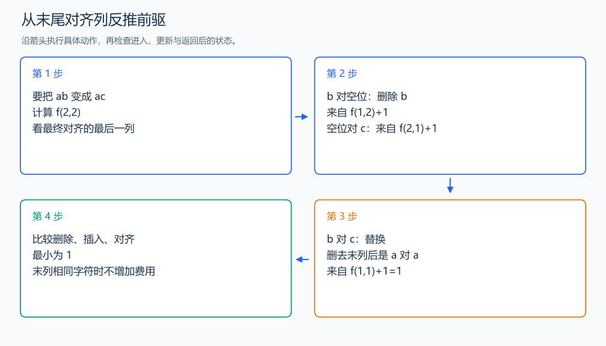

# P2758 编辑距离

[原题入口](https://www.luogu.com.cn/problem/P2758)

对应章节：五、数据结构与算法 → （十三） 动态规划（DP）基础。

## （一） 任务与输出目标

把字符串 A 变成 B，插入、删除、替换各算一次，求最少次数。

## （二） 建模与推导

定义 f(i,j) 为 A 的前 i 个字符变成 B 的前 j 个字符的最少代价。观察最终的对齐结果最后一列：A 的末字符对着空位，删除它，前驱是 f(i-1,j)，代价加 1；空位对着 B 的末字符，插入它，前驱 f(i,j-1)，加 1；两个末字符对齐，前驱 f(i-1,j-1)，相同加 0、不同替换加 1。每种对齐列删去后都留下一个更短前缀问题，接回能恢复方案，因此覆盖全部候选。最优前缀替换较差前缀不会改变最后一列，故取三项最小值。

初始 f(0,j)=j、f(i,0)=i，分别连续插入与删除。按 i、j 递增，上一行、当前行左格、上一行左上格都已计算。只保存两行时，插入读取当前行，另外两项读取上一行。答案为 f(n,m)。

## （三） 手算与过程

ab→ac：末尾 b 与 c 对齐需要一次替换，前缀 a→a 为 0，所以候选为 1；删 b 再插 c 要 2 次。



## （四） 带注释实现

[完整源文件](../../code/P2758.cpp)

```cpp
#include <bits/stdc++.h> // 竞赛模板中的常用标准库工具。
#define int long long   // 统一使用较大的整数类型。
#define endl '\n'       // 普通输出换行，避免逐行刷新。
using namespace std;

void solve() {
    string a,b; cin >> a >> b; int n=a.size(),m=b.size();
    vector<int> previous(m+1),current(m+1); iota(previous.begin(),previous.end(),0);
    for (int i=1;i<=n;++i) {
        current[0]=i; // 把前 i 个字符全删掉。
        for (int j=1;j<=m;++j)
            current[j]=min({previous[j]+1,current[j-1]+1,
                            previous[j-1]+(a[i-1]!=b[j-1])}); // 删除、插入、末尾对齐。
        swap(previous,current); // 已完成的一行成为下一轮的前驱。
    }
    cout << previous[m] << '\n';
}

signed main() {
    ios::sync_with_stdio(false); // 关闭同步，使用 cin 与 cout 完成输入输出。
    cin.tie(0), cout.tie(0);

    int T = 1; // 本题读入一组数据。
    // cin >> T; // 题目给出测试组数时开启，并在 solve 中处理一组。
    while (T--)
        solve();
}
```

头文件 `<bits/stdc++.h>` 汇总 GNU C++ 的常用标准库，包含本程序使用的流、容器与算法；这是序言竞赛模板中的包含方式。

## （五） 复杂度

时间 $O(nm)$，两行空间 $O(m)$。

[返回本章题解索引](README.md) · [返回全部题号索引](../../README.md)
