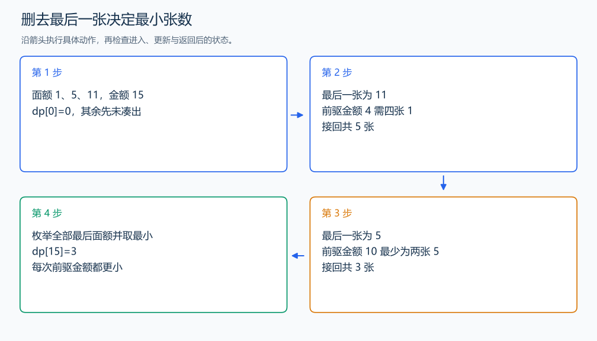

# P2842 纸币问题 1

[原题入口](https://www.luogu.com.cn/problem/P2842)

对应章节：五、数据结构与算法 → （十三） 动态规划（DP）基础。

## （一） 任务与输出目标

各面额可无限使用，恰好凑到金额 w，求最少纸币张数。

## （二） 建模与推导

定义 `dp[s]` 为恰好凑出 s 的最少张数。任意方案删去最后一张面额 a 的纸币后，剩余金额为 s-a；替换成该金额的最少张数方案再接回一张，得到 `dp[s-a]`+1。枚举所有可用面额，取最小值，便得到 `dp[s]`。

`dp[0]`=0，其他金额初始为很大的值表示尚未凑出。金额从小到大，每张面额为正，前驱 s-a 已计算；同面额可以多次成为最后一张，所以这是完全背包的最小值版本。答案为 `dp[w]`。

## （三） 手算与过程

面额 1、5、11，金额 15：拿 11 后还需四张 1，共 5；三张 5 只需 3，最优为 3。



## （四） 带注释实现

[完整源文件](../../code/P2842.cpp)

```cpp
#include <bits/stdc++.h>
using namespace std;


int main() {
    int n,w; cin >> n >> w;
    vector<int> a(n); for (int& x : a) cin >> x;
    vector<int> dp(w+1,w+1); dp[0]=0;
    for (int s=1;s<=w;++s) for (int value : a)
        if (value<=s) dp[s]=min(dp[s],dp[s-value]+1); // 删去最后一张，再接回一张。
    cout << dp[w] << '\n';
}
```

头文件 `<bits/stdc++.h>` 汇总 GNU C++ 的常用标准库，包含本程序使用的流、容器与算法；这是序言竞赛模板中的包含方式。

## （五） 复杂度

时间 $O(nw)$，空间 $O(n+w)$。

[返回本章题解索引](README.md) · [返回全部题号索引](../../README.md)
