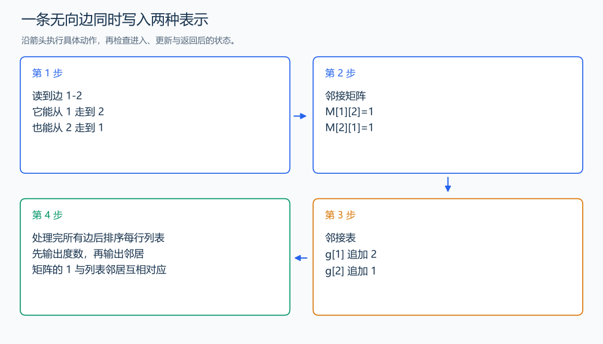

# B3643 图的存储

[原题入口](https://www.luogu.com.cn/problem/B3643)

对应章节：五、数据结构与算法 → （十五） 图论入门。

## （一） 任务与输出目标

把无向图输出成邻接矩阵与按编号排序的邻接表。

## （二） 建模与推导

读到边 u-v 时，矩阵两个对称位置都置 1，邻接表则在 u 后追加 v、在 v 后追加 u。矩阵表示任意两点是否直接相连，列表只保存实际邻居。每行邻接表先输出列表长度，即度数，再输出排序后的邻居。两个表示的内容要相互对应。

## （三） 手算与过程

边 1-2、2-3：第 2 行矩阵为 1,0,1，邻接表第 2 行为“2 1 3”，先输出度数 2。



## （四） 带注释实现

[完整源文件](../../code/B3643.cpp)

```cpp
#include <bits/stdc++.h>
using namespace std;


int main() {
    int n,m;cin>>n>>m;
    vector<vector<int>> matrix(n+1,vector<int>(n+1,0)),g(n+1);
    while(m--){int u,v;cin>>u>>v;matrix[u][v]=matrix[v][u]=1;g[u].push_back(v);g[v].push_back(u);}
    for(int i=1;i<=n;++i){for(int j=1;j<=n;++j)cout<<matrix[i][j]<<' ';cout<<'\n';}
    for(int i=1;i<=n;++i){
        sort(g[i].begin(),g[i].end()); // 原输入顺序不一定等于邻居编号顺序。
        cout<<g[i].size();for(int v:g[i])cout<<' '<<v;cout<<'\n';
    }
}
```

头文件 `<bits/stdc++.h>` 汇总 GNU C++ 的常用标准库，包含本程序使用的流、容器与算法；这是序言竞赛模板中的包含方式。

## （五） 复杂度

矩阵输出 $O(n^2)$，列表排序上界 $O(m\log m)$；空间 $O(n^2+m)$。

[返回本章题解索引](README.md) · [返回全部题号索引](../../README.md)
