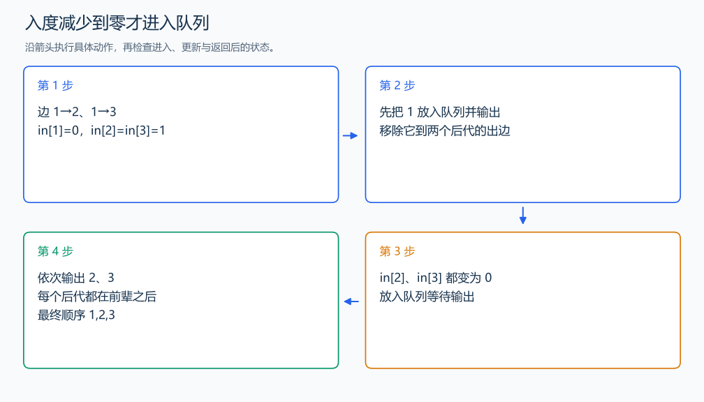

# B3644 拓扑排序／家谱树

[原题入口](https://www.luogu.com.cn/problem/B3644)

对应章节：五、数据结构与算法 → （十五） 图论入门。

## （一） 任务与输出目标

输出祖先先于后代的顺序。

## （二） 建模与推导

把每个祖先到后代画成有向边。indegree 记录尚未输出的前驱数；为 0 的人可以立刻输出。输出 u 后，视为移除它的出边，每个后代的 indegree 减一，减成 0 就进入队列。任何顶点输出时它的全部前驱都已处理，因此所有边都从较早输出指向较晚输出。

## （三） 手算与过程

1 是 2、3 的前辈：先输出 1，再输出 2、3；后两人之间没有顺序要求。



## （四） 带注释实现

[完整源文件](../../code/B3644.cpp)

```cpp
#include <bits/stdc++.h>
using namespace std;


int main() {
    int n;cin>>n;vector<vector<int>>g(n+1);vector<int>in(n+1,0);
    for(int u=1;u<=n;++u){int v;while(cin>>v&&v!=0){g[u].push_back(v);++in[v];}}
    queue<int>q;for(int i=1;i<=n;++i)if(in[i]==0)q.push(i);
    while(!q.empty()){
        int u=q.front();q.pop();cout<<u<<' ';
        for(int v:g[u])if(--in[v]==0)q.push(v); // 所有前辈输出后才轮到当前人。
    }
    cout<<'\n';
}
```

头文件 `<bits/stdc++.h>` 汇总 GNU C++ 的常用标准库，包含本程序使用的流、容器与算法；这是序言竞赛模板中的包含方式。

## （五） 复杂度

时间 $O(n+m)$，空间 $O(n+m)$。

[返回本章题解索引](README.md) · [返回全部题号索引](../../README.md)
