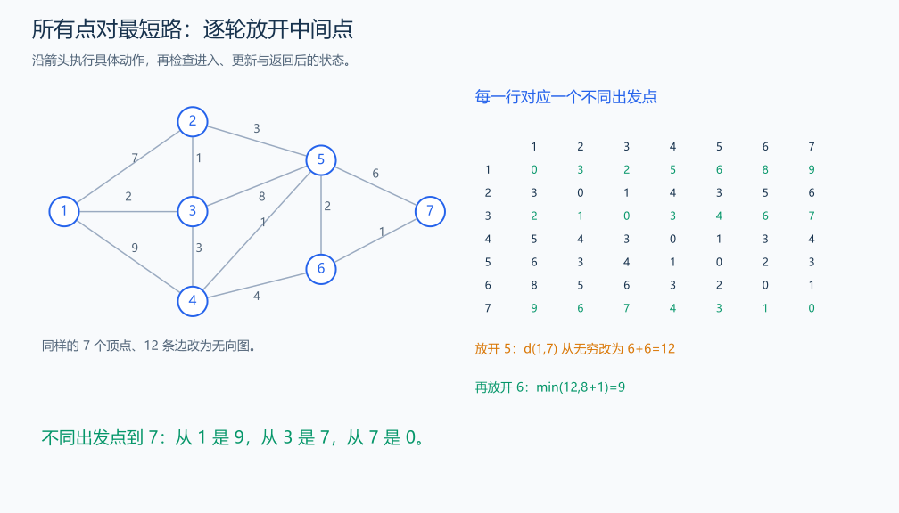

# B3647 Floyd

[原题入口](https://www.luogu.com.cn/problem/B3647)

对应章节：五、数据结构与算法 → （十五） 图论入门。

## （一） 任务与输出目标

求无向连通图所有点对的最短距离。

## （二） 建模与推导

定义 D_k(i,j) 为路线中间点只从编号 1 到 k 里选时的最短距离。最优路线不使用 k，来自 D_(k-1)(i,j)；使用 k，就在 k 处分成 i→k 与 k→j，两段内部都来自更小编号，于是候选为 D_(k-1)(i,k)+D_(k-1)(k,j)。较差的两段可分别换成最短段，因此取这两项最小。

初始矩阵只允许直接边，自己到自己为 0，平行边保留最小权。按 k 放在最外层，依次放开一个中间点；最终矩阵同时保存不同出发点的结果，和单源距离数组不同。

## （三） 手算与过程

1-2 长 2，2-3 长 3，1-3 长 10；放开中间点 2 后，两种方向的 1、3 距离都从 10 改为 5。

图中使用 7 个顶点、12 条无向边。矩阵行号是出发点，列号是终点；允许中转点 5 后，到 7 的候选为 6+6=12，再允许 6 后改善为 8+1=9。第 1 行和同图从 1 出发的单源结果一致，第 3 行则回答从 3 出发的问题。



## （四） 带注释实现

[完整源文件](../../code/B3647.cpp)

```cpp
#include <bits/stdc++.h> // 竞赛模板中的常用标准库工具。
#define int long long   // 统一使用较大的整数类型。
#define endl '\n'       // 普通输出换行，避免逐行刷新。
using namespace std;

void solve() {
    int n,m;cin>>n>>m;const long long inf=LLONG_MAX/4;
    vector<vector<long long>>d(n+1,vector<long long>(n+1,inf));
    for(int i=1;i<=n;++i)d[i][i]=0;
    while(m--){int u,v;long long w;cin>>u>>v>>w;d[u][v]=d[v][u]=min(d[u][v],w);}
    for(int k=1;k<=n;++k)for(int i=1;i<=n;++i)for(int j=1;j<=n;++j)
        if(d[i][k]!=inf&&d[k][j]!=inf)d[i][j]=min(d[i][j],d[i][k]+d[k][j]); // 放开中间点 k。
    for(int i=1;i<=n;++i){for(int j=1;j<=n;++j)cout<<d[i][j]<<' ';cout<<'\n';}
}

signed main() {
    ios::sync_with_stdio(false); // 关闭同步，使用 cin 与 cout 完成输入输出。
    cin.tie(0), cout.tie(0);

    int T = 1; // 本题读入一组数据。
    // cin >> T; // 题目给出测试组数时开启，并在 solve 中处理一组。
    while (T--)
        solve();
}
```

头文件 `<bits/stdc++.h>` 汇总 GNU C++ 的常用标准库，包含本程序使用的流、容器与算法；这是序言竞赛模板中的包含方式。

## （五） 复杂度

时间 $O(n^3)$，矩阵空间 $O(n^2)$。

[返回本章题解索引](README.md) · [返回全部题号索引](../../README.md)
