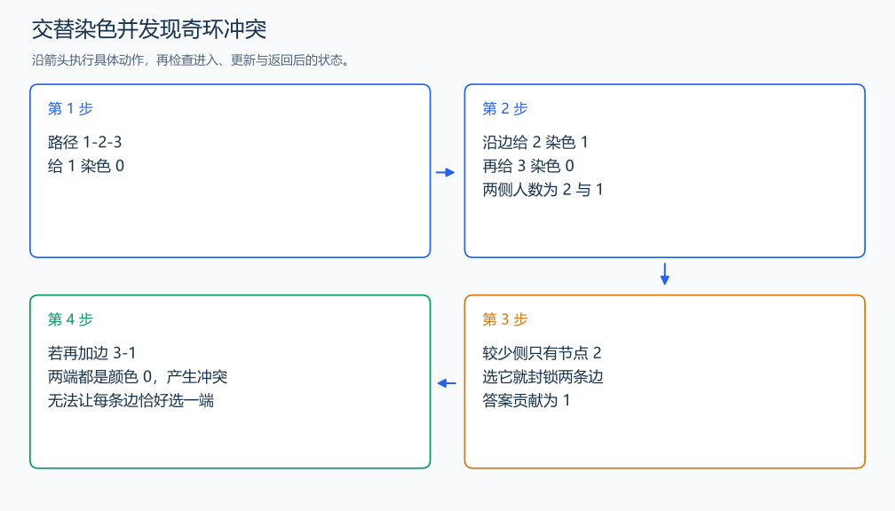

# P1330 封锁阳光大学

[原题入口](https://www.luogu.com.cn/problem/P1330)

对应章节：五、数据结构与算法 → （十五） 图论入门。

## （一） 任务与输出目标

选择不相邻的最少顶点，封锁每一条道路。

## （二） 建模与推导

每条边至少一端被选才能封锁，又不能两端都选，因此恰好选一端。沿边必须在选与不选之间交替，等价于二染色。每个连通块从一个点给颜色 0，邻点给反色，发现同色边就无法完成；奇环会造成这类冲突。完成二染色后，选任一整侧都会覆盖所有边，取人数较少的一侧。孤立点没有道路需要封锁，它的另一侧人数为 0，所以贡献为 0。

## （三） 手算与过程

链 1-2-3：选中间点 2 即可封锁两边，答案 1；三角形沿环交替后出现同色边，无解。



## （四） 带注释实现

[完整源文件](../../code/P1330.cpp)

```cpp
#include <bits/stdc++.h> // 竞赛模板中的常用标准库工具。
#define int long long   // 统一使用较大的整数类型。
#define endl '\n'       // 普通输出换行，避免逐行刷新。
using namespace std;

void solve() {
    int n,m;cin>>n>>m;vector<vector<int>>g(n+1);
    while(m--){int u,v;cin>>u>>v;g[u].push_back(v);g[v].push_back(u);}
    vector<int> color(n+1,-1);int answer=0;
    for(int start=1;start<=n;++start){
        if(color[start]!=-1)continue;
        int count[2]={1,0};queue<int>q;q.push(start);color[start]=0;
        while(!q.empty()){
            int u=q.front();q.pop();
            for(int v:g[u]){
                if(color[v]==-1){color[v]=color[u]^1;++count[color[v]];q.push(v);}
                else if(color[v]==color[u]){cout<<"Impossible\n";return;} // 相邻同侧无法满足两项要求。
            }
        }
        answer+=min(count[0],count[1]);
    }
    cout<<answer<<'\n';
}

signed main() {
    ios::sync_with_stdio(false); // 关闭同步，使用 cin 与 cout 完成输入输出。
    cin.tie(0), cout.tie(0);

    int T = 1; // 本题读入一组数据。
    // cin >> T; // 题目给出测试组数时开启，并在 solve 中处理一组。
    while (T--)
        solve();
}
```

头文件 `<bits/stdc++.h>` 汇总 GNU C++ 的常用标准库，包含本程序使用的流、容器与算法；这是序言竞赛模板中的包含方式。

## （五） 复杂度

时间 $O(n+m)$，空间 $O(n+m)$。

[返回本章题解索引](README.md) · [返回全部题号索引](../../README.md)
