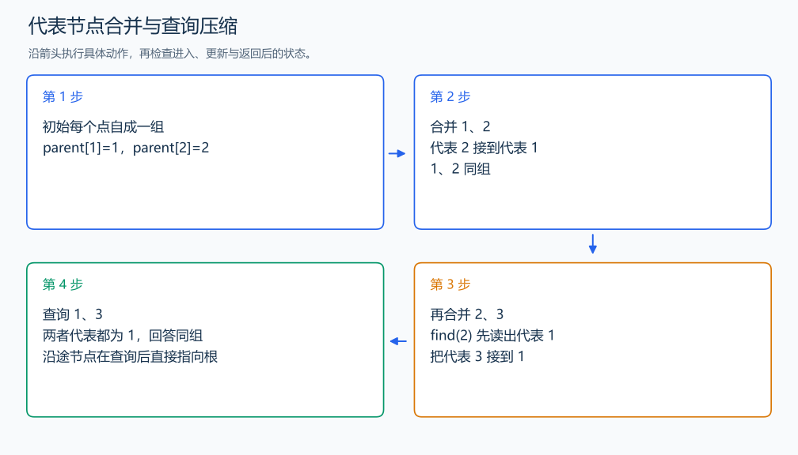

# P1551 亲戚

[原题入口](https://www.luogu.com.cn/problem/P1551)

对应章节：五、数据结构与算法 → （十四） 并查集。

## （一） 任务与输出目标

合并亲戚关系后，回答两个人是否在同一家族。

## （二） 建模与推导

关系会传递，因此不能只检查两人之间是否直接出现过一条边。每组用一个代表节点，合并时把两组的代表连接；查询时沿 parent 找到最终代表。沿途节点在找到根后直接指向根，后续查询会更短。按组大小把较小树挂到较大树，不必重写组内所有成员。

## （三） 手算与过程

先合并 1、2，再合并 2、3，1 与 3 虽未直接连接也具有同一代表；4 仍是另一组。



## （四） 带注释实现

[完整源文件](../../code/P1551.cpp)

```cpp
#include <bits/stdc++.h>
using namespace std;

struct DSU {
    vector<int> parent,size;
    DSU(int n):parent(n+1),size(n+1,1){iota(parent.begin(),parent.end(),0);}
    int find(int x){return parent[x]==x?x:parent[x]=find(parent[x]);} // 路径压缩到代表节点。
    bool unite(int a,int b){
        a=find(a);b=find(b);if(a==b)return false;
        if(size[a]<size[b])swap(a,b);
        parent[b]=a;size[a]+=size[b];return true; // 小树挂到大树，控制路径长度。
    }
};

int main() {
    int n,m,q; cin>>n>>m>>q;
    DSU dsu(n);
    while(m--){int a,b;cin>>a>>b;dsu.unite(a,b);} // 把给定关系的两组连起来。
    while(q--){int a,b;cin>>a>>b;cout<<(dsu.find(a)==dsu.find(b)?"Yes":"No")<<'\n';}
}
```

头文件 `<bits/stdc++.h>` 汇总 GNU C++ 的常用标准库，包含本程序使用的流、容器与算法；这是序言竞赛模板中的包含方式。

## （五） 复杂度

路径压缩与按大小合并，n 次初始化、M 次操作共 $O(n+M\alpha(n))$，空间 $O(n)$。

[返回本章题解索引](README.md) · [返回全部题号索引](../../README.md)
