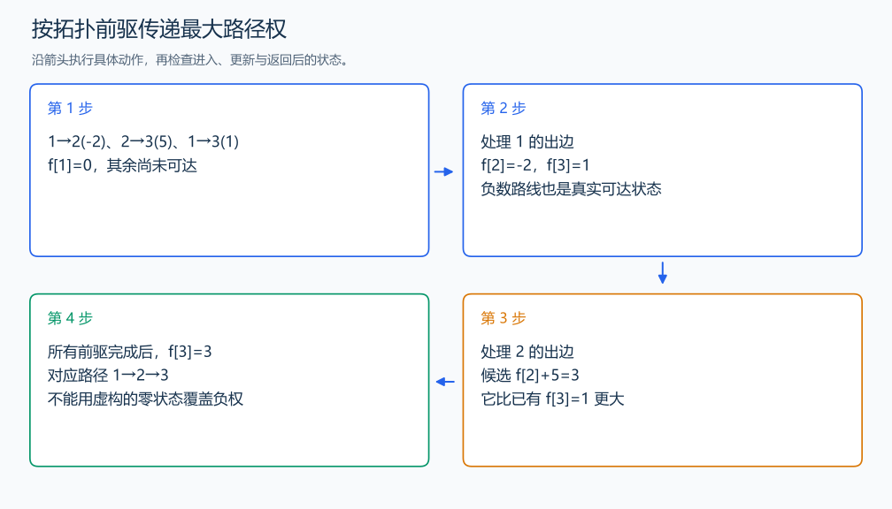

# P1807 最长路

[原题入口](https://www.luogu.com.cn/problem/P1807)

对应章节：五、数据结构与算法 → （十五） 图论入门。

## （一） 任务与输出目标

在带权 DAG 中求从 1 到 n 的最长路，无法到达时输出 -1。

## （二） 建模与推导

`f[v]` 为从 1 到 v 的最大路径权和。把一条以 u→v 结尾的路径去掉最后一条边，剩下的是从 1 到 u 的路径，接回权 w 得到 `f[u]`+w；按最后一条边枚举全部前驱，取最大。较差前缀换成最大前缀不会改变终点和最后边，所以只保存一个最大值。

初始 `f[1]`=0，其他为负无穷表示没有路线，不能全设为 0，否则负权路线会被虚构的零路线覆盖。拓扑序保证 u 的前驱先算完，再沿出边更新；所有顶点都参与入度消除，但只有从 1 已到达的状态能传递距离。

## （三） 手算与过程

1→2 权 -2，2→3 权 5，1→3 权 1：前两条合成 3，比直达的 1 更大。



## （四） 带注释实现

[完整源文件](../../code/P1807.cpp)

```cpp
#include <bits/stdc++.h>
#define int long long
#define endl '\n'
using namespace std;

void solve() {
    int n, m;
    cin >> n >> m;
    vector<vector<pair<int, int>>> g(n + 1);
    vector<int> in(n + 1, 0);
    while (m--) {
        int u, v, w;
        cin >> u >> v >> w;
        g[u].emplace_back(v, w);
        ++in[v];
    }
    const int neg = LLONG_MIN / 4;
    vector<int> f(n + 1, neg);
    f[1] = 0;
    queue<int> q;
    for (int i = 1; i <= n; ++i)
        if (in[i] == 0)
            q.push(i);
    while (!q.empty()) {
        int u = q.front();
        q.pop();
        for (auto [v, w] : g[u]) {
            if (f[u] != neg)
                f[v] = max(f[v], f[u] + w); // 仅传递实际可达的前缀路径。
            if (--in[v] == 0)
                q.push(v);
        }
    }
    cout << (f[n] == neg ? -1 : f[n]) << '\n';
}

signed main() {
    ios::sync_with_stdio(false); // 关闭同步，使用 cin 与 cout 完成输入输出。
    cin.tie(0), cout.tie(0);

    int T = 1; // 本题读入一组数据。
    // cin >> T; // 题目给出测试组数时开启，并在 solve 中处理一组。
    while (T--)
        solve();
}
```

## （五） 复杂度

时间 $O(n+m)$，空间 $O(n+m)$。

[返回本章题解索引](README.md) · [返回全部题号索引](../../README.md)
