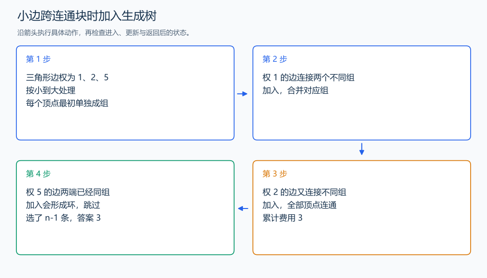

# P3366 最小生成树

[原题入口](https://www.luogu.com.cn/problem/P3366)

对应章节：五、数据结构与算法 → （十五） 图论入门。

## （一） 任务与输出目标

选 n-1 条边连通全部顶点并最小化总权，不连通输出 orz。

## （二） 建模与推导

按边权排序，每次选连接两个不同连通块的最小边。当前块形成一个割；若某棵最优生成树没有这条边，把它加入就形成环，环上还有跨过该割的边。替换掉那条不更小的边，连通性保留、总权不增加。因此贪心选择可以接进某个最优树。两端已经同组的边会形成环，跳过；并查集负责判断与合并。选满 n-1 条时得到生成树，否则仍存在分开的块。

## （三） 手算与过程

三角形边权 1、2、5：先选 1 和 2，第三边两端已经同组，跳过，总代价 3。



## （四） 带注释实现

[完整源文件](../../code/P3366.cpp)

```cpp
#include <bits/stdc++.h> // 竞赛模板中的常用标准库工具。
#define int long long   // 统一使用较大的整数类型。
#define endl '\n'       // 普通输出换行，避免逐行刷新。
using namespace std;

struct DSU {
    vector<int> parent,size;
    DSU(int n):parent(n+1),size(n+1,1){iota(parent.begin(),parent.end(),0);}
    int find(int x){return parent[x]==x?x:parent[x]=find(parent[x]);} // 路径压缩到代表节点。
    bool unite(int a,int b){
        a=find(a);b=find(b);if(a==b)return false;
        if(size[a]<size[b])swap(a,b);
        parent[b]=a;size[a]+=size[b];return true; // 小树挂到大树，控制路径长度。
    }
};

void solve() {
    int n,m;cin>>n>>m;vector<tuple<int,int,int>>edges(m);
    for(auto& [w,u,v]:edges)cin>>u>>v>>w;
    sort(edges.begin(),edges.end());DSU dsu(n);long long answer=0;int chosen=0;
    for(auto [w,u,v]:edges)if(dsu.unite(u,v)){answer+=w;++chosen;} // 不同组之间才加入边。
    if(chosen==n-1)cout<<answer<<'\n';else cout<<"orz\n";
}

signed main() {
    ios::sync_with_stdio(false); // 关闭同步，使用 cin 与 cout 完成输入输出。
    cin.tie(0), cout.tie(0);

    int T = 1; // 本题读入一组数据。
    // cin >> T; // 题目给出测试组数时开启，并在 solve 中处理一组。
    while (T--)
        solve();
}
```

头文件 `<bits/stdc++.h>` 汇总 GNU C++ 的常用标准库，包含本程序使用的流、容器与算法；这是序言竞赛模板中的包含方式。

## （五） 复杂度

排序 $O(m\log m)$，并查集 $O(m\alpha(n))$，空间 $O(n+m)$。

[返回本章题解索引](README.md) · [返回全部题号索引](../../README.md)
