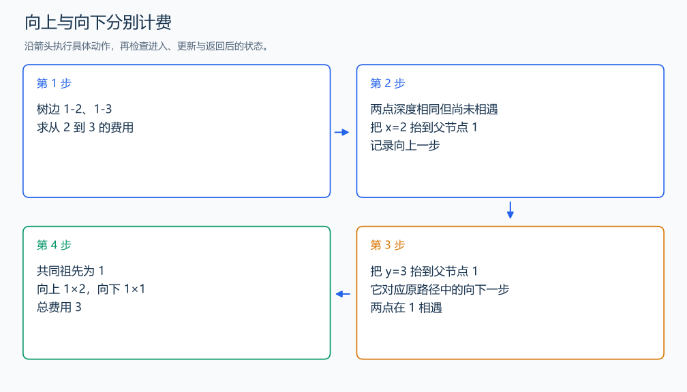

# P3884 二叉树问题

[原题入口](https://www.luogu.com.cn/problem/P3884)

对应章节：五、数据结构与算法 → （八） 二叉树；五、数据结构与算法 → （十五） 图论入门。

## （一） 任务与输出目标

计算树的深度、最大层宽，以及从 x 到 y 向上代价 2、向下代价 1 的距离。

## （二） 建模与推导

先从根 BFS，给节点设置父节点和深度，按层累计人数，最大层数就是深度、最多人数就是宽度。x 与 y 的唯一路径要先向上到共同祖先，再向下。先把较深的端点抬到相同深度：抬 x 记录向上一步、抬 y 记录最终路径向下一步；随后同时抬直到相遇。x 的累计步数乘 2，y 的累计步数乘 1，二者相加。这是有方向代价的距离，交换 x、y 后可能变化。

## （三） 手算与过程

树边 1-2、1-3，从 2 到 3 先向上 1 步、向下 1 步，费用 2+1=3；深度 2、宽度 2。



## （四） 带注释实现

[完整源文件](../../code/P3884.cpp)

```cpp
#include <bits/stdc++.h> // 竞赛模板中的常用标准库工具。
#define int long long   // 统一使用较大的整数类型。
#define endl '\n'       // 普通输出换行，避免逐行刷新。
using namespace std;

void solve() {
    int n; cin >> n;
    vector<vector<int>> g(n+1);
    for(int i=1;i<n;++i) { int u,v; cin >> u >> v; g[u].push_back(v); g[v].push_back(u); }
    vector<int> parent(n+1),depth(n+1),width(n+1,0);
    queue<int> q; q.push(1); depth[1]=1; int maxdepth=0,maxwidth=0;
    while(!q.empty()) {
        int u=q.front();q.pop(); maxdepth=max(maxdepth,depth[u]);
        maxwidth=max(maxwidth,++width[depth[u]]);
        for(int v:g[u]) if(v!=parent[u]) { parent[v]=u;depth[v]=depth[u]+1;q.push(v); }
    }
    int x,y;cin>>x>>y;int up=0,down=0;
    while(depth[x]>depth[y]) {x=parent[x];++up;}
    while(depth[y]>depth[x]) {y=parent[y];++down;}
    while(x!=y) {x=parent[x];y=parent[y];++up;++down;} // 相遇点是两条路径的共同祖先。
    cout<<maxdepth<<'\n'<<maxwidth<<'\n'<<2*up+down<<'\n';
}

signed main() {
    ios::sync_with_stdio(false); // 关闭同步，使用 cin 与 cout 完成输入输出。
    cin.tie(0), cout.tie(0);

    int T = 1; // 本题读入一组数据。
    // cin >> T; // 题目给出测试组数时开启，并在 solve 中处理一组。
    while (T--)
        solve();
}
```

头文件 `<bits/stdc++.h>` 汇总 GNU C++ 的常用标准库，包含本程序使用的流、容器与算法；这是序言竞赛模板中的包含方式。

## （五） 复杂度

时间 $O(n)$，空间 $O(n)$。

[返回本章题解索引](README.md) · [返回全部题号索引](../../README.md)
