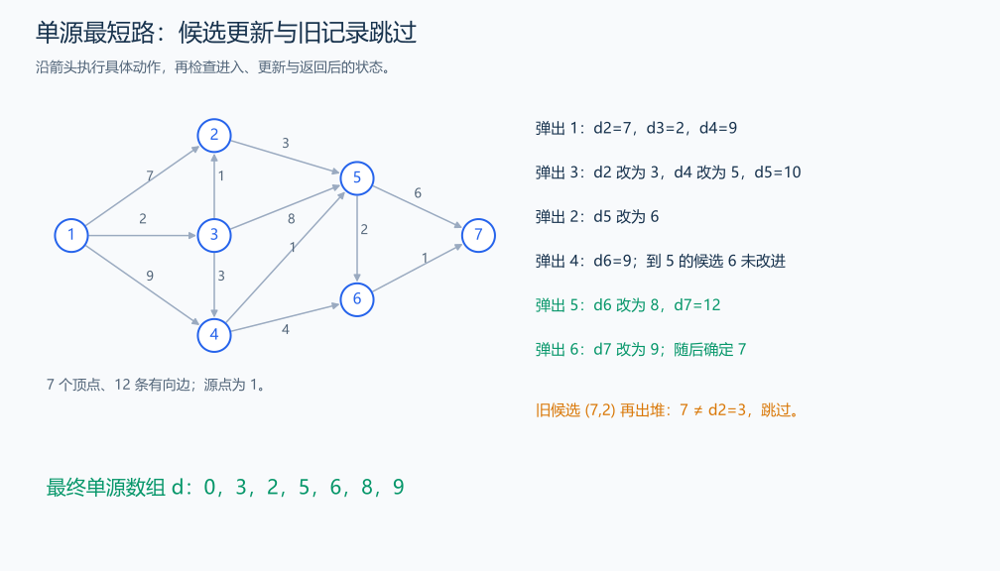

# P4779 单源最短路径（标准版）

[原题入口](https://www.luogu.com.cn/problem/P4779)

对应章节：五、数据结构与算法 → （十五） 图论入门。

## （一） 任务与输出目标

给出有向非负权图和源点，求源点到所有点的最短距离。

## （二） 建模与推导

`dist[v]` 保存目前找到的从源点到 v 的最短路线长度，源点为 0，其他点先记为无穷。每次从小根堆取当前距离最小的候选 u；剩余边权不会减小路径长度，所以尚未确定的路径不可能绕到别处后再得到更短的 u。用 `dist[u]`+w 尝试改善每条出边的终点，成功就更新并放入堆。

同一顶点可能多次入堆，旧记录的距离已经不是 `dist[u]` 时跳过，这条路线已被更短路线替代。图是有向的，读入只保存 u→v，不额外加入反向边。多个源点各自到全图的距离需要分别运行本过程，或用 Floyd 保存全部点对；本题只有一个源点。

## （三） 手算与过程

1→2(7)、1→3(2)、3→2(1)：先发现到 2 的长度 7，再经 3 改成 3；堆中旧的 (7,2) 会被跳过。

图中把这个过程扩展到 7 个顶点、12 条边。出堆顺序中，3 把到 2 的距离从 7 改为 3，2 再把到 5 的距离改为 6；5 改善到 6 的距离，6 改善到 7 的距离。旧候选随后跳过，最终从 1 到各点的距离为 0、3、2、5、6、8、9。



## （四） 带注释实现

[完整源文件](../../code/P4779.cpp)

```cpp
#include <bits/stdc++.h>
#define int long long
#define endl '\n'
using namespace std;

void solve() {
    int n, m, s;
    cin >> n >> m >> s;
    vector<vector<pair<int, int>>> g(n + 1);
    while (m--) {
        int u, v;
        int w;
        cin >> u >> v >> w;
        g[u].emplace_back(v, w);
    }
    const int inf = LLONG_MAX / 4;
    vector<int> dist(n + 1, inf);
    dist[s] = 0;
    using State = pair<int, int>;
    priority_queue<State, vector<State>, greater<State>> heap;
    heap.emplace(0, s);
    while (!heap.empty()) {
        auto [length, u] = heap.top();
        heap.pop();
        if (length != dist[u])
            continue; // 跳过已被改进的旧候选。
        for (auto [v, w] : g[u])
            if (dist[v] > length + w) {
                dist[v] = length + w;
                heap.emplace(dist[v], v);
            }
    }
    for (int i = 1; i <= n; ++i)
        cout << (dist[i] == inf ? 2147483647LL : dist[i]) << ' ';
    cout << '\n';
}

signed main() {
    ios::sync_with_stdio(false); // 关闭同步，使用 cin 与 cout 完成输入输出。
    cin.tie(0), cout.tie(0);

    int T = 1; // 本题读入一组数据。
    // cin >> T; // 题目给出测试组数时开启，并在 solve 中处理一组。
    while (T--)
        solve();
}
```

## （五） 复杂度

每条边至多造成一次成功松弛并入堆，时间 $O((n+m)\log(m+1))$，空间 $O(n+m)$。

[返回本章题解索引](README.md) · [返回全部题号索引](../../README.md)
