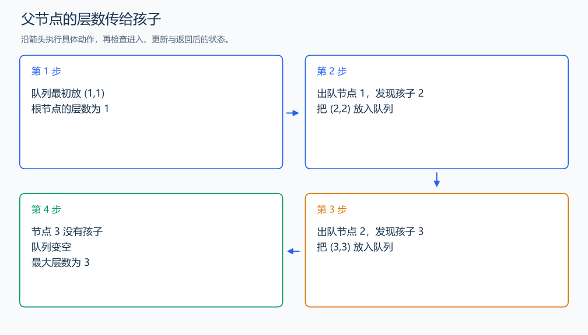

# P4913 二叉树深度

[原题入口](https://www.luogu.com.cn/problem/P4913)

对应章节：五、数据结构与算法 → （八） 二叉树；五、数据结构与算法 → （十五） 图论入门。

## （一） 任务与输出目标

给出每个节点的左右孩子编号，求以 1 为根的最大层数。

## （二） 建模与推导

根的层数为 1，孩子的层数等于父节点加一。队列保存节点和层数，逐个把非零孩子放入下一层，记录最大值。用显式队列保存待处理节点，长链也按一轮一个节点展开，不把每层变成一次嵌套函数调用。

## （三） 手算与过程

1 的孩子是 2，2 的孩子是 3，三个节点依次得到深度 1、2、3，答案为 3。



## （四） 带注释实现

[完整源文件](../../code/P4913.cpp)

```cpp
#include <bits/stdc++.h>
using namespace std;


int main() {
    ios::sync_with_stdio(false); cin.tie(nullptr);
    int n; cin >> n;
    vector<array<int,2>> child(n+1);
    for(int i=1;i<=n;++i) cin >> child[i][0] >> child[i][1];
    queue<pair<int,int>> q; q.emplace(1,1); int answer=0;
    while(!q.empty()) {
        auto [u,depth]=q.front(); q.pop(); answer=max(answer,depth);
        for(int v : child[u]) if(v!=0) q.emplace(v,depth+1); // 0 表示没有这个孩子。
    }
    cout << answer << '\n';
}
```

头文件 `<bits/stdc++.h>` 汇总 GNU C++ 的常用标准库，包含本程序使用的流、容器与算法；这是序言竞赛模板中的包含方式。

## （五） 复杂度

每节点处理一次，时间 $O(n)$，孩子表和队列占 $O(n)$。

[返回本章题解索引](README.md) · [返回全部题号索引](../../README.md)
