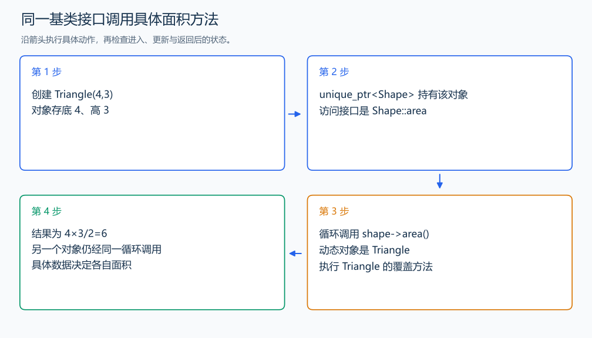

# OOP3 通过 Shape 调用 Triangle 面积

自拟练习：对应笔记面向对象部分。

对应章节：二、面向对象编程 → （九）面向对象部分的练习。

## （一） 任务与输出目标

为 Shape 增加 Triangle 派生类，通过同一个遍历循环输出面积。

## （二） 建模与推导

Shape 声明虚函数 area，Triangle 覆盖它并保存底、高。容器保存指向 Shape 的 unique_ptr，循环只调用共同接口；具体对象为 Triangle 时执行三角形面积计算。虚析构函数让通过基类指针销毁时执行完整对象的析构，unique_ptr 负责容器中对象的所有权。

## （三） 手算与过程

底高 (4,3)、(6,5) 的面积依次为 6、15，两次调用都经 Shape 接口。



## （四） 带注释实现

[完整源文件](../../code/OOP3.cpp)

```cpp
#include <bits/stdc++.h> // 竞赛模板中的常用标准库工具。
#define int long long   // 统一使用较大的整数类型。
#define endl '\n'       // 普通输出换行，避免逐行刷新。
using namespace std;

struct Shape{
    virtual double area()const=0;
    virtual ~Shape()=default; // 通过基类指针销毁时完成派生对象的销毁。
};
class Triangle:public Shape{
    double base,height;
public:
    Triangle(double b,double h):base(b),height(h){}
    double area()const override{return base*height/2;}
};

void solve() {
    vector<unique_ptr<Shape>> shapes;
    shapes.push_back(make_unique<Triangle>(4,3));
    shapes.push_back(make_unique<Triangle>(6,5));
    for(const auto& shape:shapes)cout<<fixed<<setprecision(2)<<shape->area()<<'\n'; // 同一接口调用不同对象。
}

signed main() {
    ios::sync_with_stdio(false); // 关闭同步，使用 cin 与 cout 完成输入输出。
    cin.tie(0), cout.tie(0);

    int T = 1; // 本题读入一组数据。
    // cin >> T; // 题目给出测试组数时开启，并在 solve 中处理一组。
    while (T--)
        solve();
}
```

头文件 `<bits/stdc++.h>` 汇总 GNU C++ 的常用标准库，包含本程序使用的流、容器与算法；这是序言竞赛模板中的包含方式。

## （五） 复杂度

K 个对象，遍历时间 $O(K)$，存储 $O(K)$。

[返回本章题解索引](README.md) · [返回全部题号索引](../../README.md)
