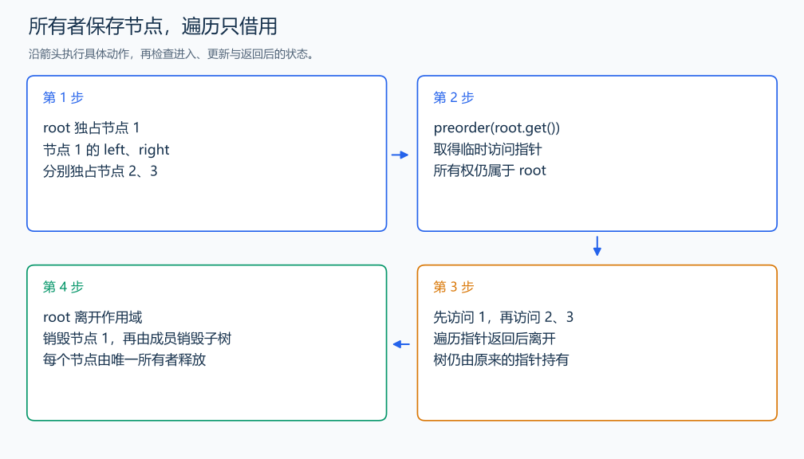

# OOP4 二叉树节点的所有权

自拟练习：对应笔记面向对象部分。

对应章节：二、面向对象编程 → （九）面向对象部分的练习。

## （一） 任务与输出目标

用 unique_ptr 管理二叉树，说明节点的所有者与销毁顺序。

## （二） 建模与推导

根由 main 中的 unique_ptr 持有，左右子节点分别由父节点中的 unique_ptr 持有，每个节点只有一个所有者。遍历用 const Node* 临时访问节点，不取得所有权。根指针离开作用域时先销毁根对象，成员指针随后自动销毁对应子树。没有手工 delete，也没有两个指针重复拥有同一节点。

## （三） 手算与过程

根 1 拥有左子 2 和右子 3，先序输出 1,2,3；遍历指针只借用节点，根负责整个树的存活。



## （四） 带注释实现

[完整源文件](../../code/OOP4.cpp)

```cpp
#include <bits/stdc++.h>
#define int long long
#define endl '\n'
using namespace std;

struct Node {
    int value;
    unique_ptr<Node> left, right;

    explicit Node(int x) : value(x) {
    }
};

void preorder(const Node* node) {
    if (!node)
        return;
    cout << node->value << ' ';
    preorder(node->left.get());
    preorder(node->right.get()); // 按根、左、右访问。
}

void solve() {
    auto root = make_unique<Node>(1);
    root->left = make_unique<Node>(2);
    root->right = make_unique<Node>(3); // 所有权由父节点成员持有。
    preorder(root.get());
    cout << '\n'; // get 只提供访问指针，不转移所有权。
}

signed main() {
    ios::sync_with_stdio(false); // 关闭同步，使用 cin 与 cout 完成输入输出。
    cin.tie(0), cout.tie(0);

    int T = 1; // 本题读入一组数据。
    // cin >> T; // 题目给出测试组数时开启，并在 solve 中处理一组。
    while (T--)
        solve();
}
```

## （五） 复杂度

访问 n 节点时间 $O(n)$，树存储 $O(n)$，遍历栈 $O(h)$。

[返回本章题解索引](README.md) · [返回全部题号索引](../../README.md)
